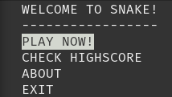
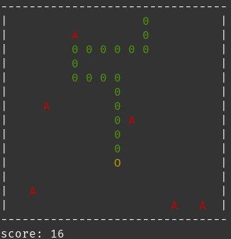

# Simple snake terminal game
This very simple program has been implemented in C using escape characters to display the game on the terminal. There should be no need to download extra libraries to execute the game. To interact with the program *wasd* can be used as well as the arrow keys.

To compile just type:
```
gcc snake.c
```

## Menu screen

## Game screen



